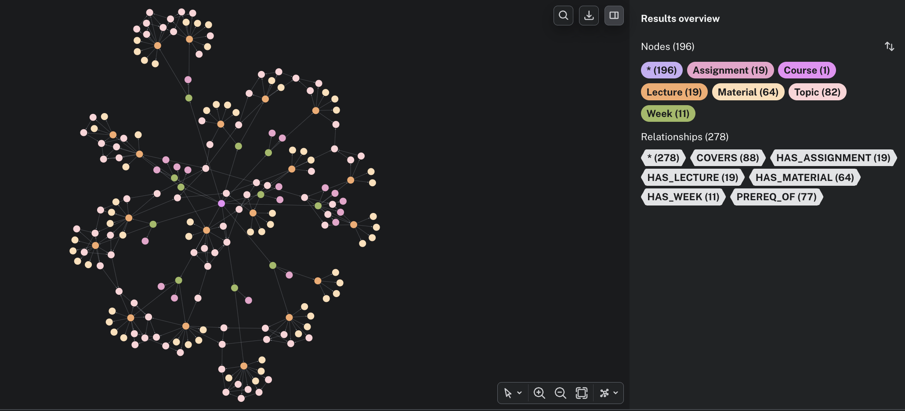
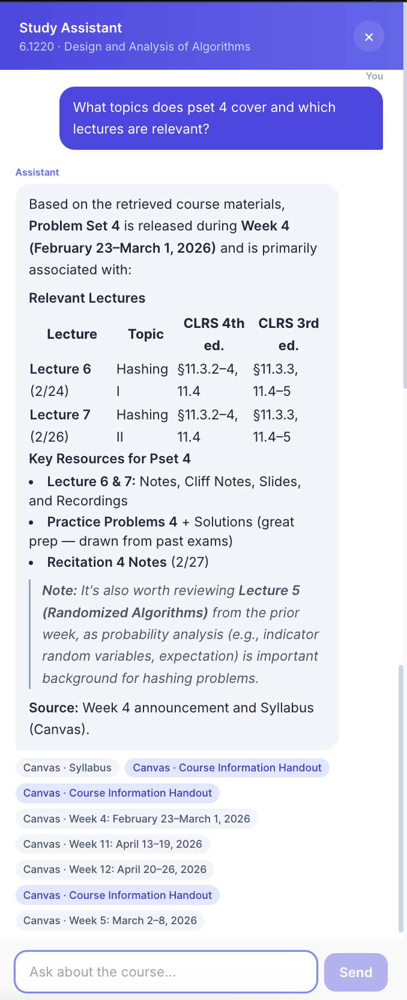
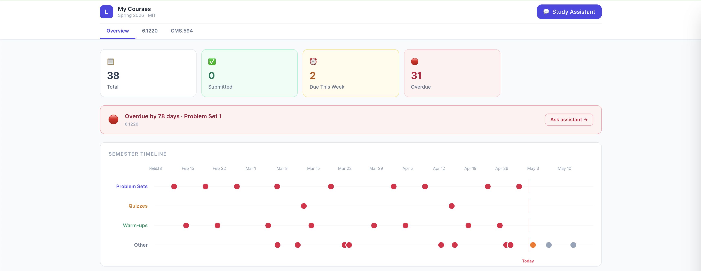

  
CMS.594 · Education Technology Studio · MIT

  <h1 class="text-5xl font-bold text-white leading-tight mb-3">Large Lecture Model</h1>
  

    A course-content intelligence platform that unifies fragmented learning environments — so students can study, not search.
  

  
Tae Wook (Terry) Kim · Spring 2026

---
layout: default
---

# The Problem

A single course lives on 5+ platforms

  

    

    <strong>Canvas</strong> — syllabus, slides, assignments
  

  

    

    <strong>Gradescope</strong> — problem sets, feedback, grades
  

  

    

    <strong>Panopto</strong> — lecture recordings & transcripts
  

  

    

    <strong>Piazza</strong> — Q&A threads, instructor answers
  

The cognitive cost

<blockquote class="pl-3 border-l-4 border-blue-400 text-slate-300 italic text-sm leading-relaxed mb-3">
"A student cannot easily cross-reference which lectures introduced a concept, which problem sets assessed it, and which Piazza threads clarified it."
</blockquote>

  
Sweller (1988) — Cognitive Load Theory

  
Platform fragmentation imposes <strong>extraneous load</strong> — cognitive effort spent navigating, not learning.

  
One interface. All course sources. Cited answers.

---
layout: default
---

# Why This Design?

  
🧠

  <h3 class="font-bold text-blue-300 text-xs uppercase tracking-wide mb-1">Cognitive Load</h3>
  
Sweller (1988): reduce <em>extraneous</em> load so students direct working memory toward learning, not navigation.

  
🎯

  <h3 class="font-bold text-purple-300 text-xs uppercase tracking-wide mb-1">Self-Regulated Learning</h3>
  
Zimmerman (2002): learners who plan, monitor, and evaluate their own study process outperform passive consumers.

  
🔄

  <h3 class="font-bold text-green-300 text-xs uppercase tracking-wide mb-1">Retrieval Practice</h3>
  
Roediger & Karpicke (2006): actively recalling information produces superior long-term retention vs. re-reading.

  
<strong class="text-white">Why RAG?</strong> A general LLM hallucinates course-specific facts. Retrieval-Augmented Generation (Lewis et al., 2020) grounds every answer in actual course documents with inline citations.

  
<strong class="text-amber-300">Behavioral concept design</strong> (6.1040 TA, 2025): model <em>behaviors</em> — asking, posting, submitting — not platform schemas. "Behaviors hold still even when platforms do not."

---
layout: default
---

# How It Works

  

---
layout: default
---

# The Knowledge Graph (6.1220)

  

Auto-built from Canvas + Panopto

<blockquote class="mt-3 pl-4 border-l-4 border-purple-400 text-slate-300 italic text-sm leading-relaxed">
  "Students who study with concept maps outperform those who re-read — the map makes prerequisite structure visible."
  — Chi, Feltovich & Glaser (1981); Novak & Gowin (1984)
</blockquote>

---
layout: default
---

# The Web Interface

  
Study Assistant — Chat

  
  

    Guardrail: "Solve PS4 Q2" → blocked, redirects to lecture material.
  

  
Dashboard — Assignments & Timeline

  
  

    Study planner: Full semester timeline with topic map and "Ask assistant" per assignment.
  

---
layout: default
---

# Feedback: Srini & Eagon

Srini — Professor, MIT 6.1220

  
Productive struggle risk

  
"Students may use the LLM to bypass the productive struggle — that's where the learning happens."

  
→ Approach-first tutoring: system asks what the student tried before helping.

  
High-value use cases

  
"Concept maps, notation guides, connecting ideas across the semester — these are where it genuinely helps."

  
→ Concept map view and notation cheatsheet promoted to first-class features.

Eagon — TA, 6.1040 & Agentic Harness Researcher

  
Design philosophy

  
"Design the way you can't fail — capture useful learning signals rather than trying to solve personalized learning immediately."

  
→ Structured event-log first; chatbot is a layer on top, not the foundation.

  
Why not just use ChatGPT?

  
General LLMs have no memory of your course. This system tracks progress — giving each stakeholder what they actually need:

  

    
📋<strong class="text-amber-300">Staff</strong> — see where students are struggling, which topics generate the most questions, what's being missed.

    
🎯<strong class="text-green-300">Students</strong> — see what they're missing so they can study efficiently and close gaps before exams.

  

---
layout: default
---

# How Feedback Was Implemented

  
🤔 Approach-first tutoring

  
System asks what the student has already tried before helping — ensuring productive struggle happens before assistance kicks in.

  
🗺️ Concept maps & notation guides

  
Topic-map view and notation cheatsheet promoted to first-class features — connecting ideas across the semester where LLMs genuinely help.

  
🧩 Modular, transparent agent design

  
Each component — ingestor, retriever, guardrail, responder — is a swappable module with a clear interface. The same pipeline generalizes to any course or institution without rewiring.

  
📂 Per-topic chat sessions

  
Each topic gets its own chat thread. Students see their engagement and gaps by topic; staff see which topics generate the most questions and where students are getting stuck.

---
layout: default
---

# Open Questions

  

    ?
    When is LLM help actually safe?
  

  
Srini's framing: LLMs are valuable once students can verify the output. How do we detect that threshold — and should we gate assistance behind it?

  

    ?
    Measuring productive struggle bypass
  

  
Approach-first tutoring is a policy — but can we measure whether students actually attempt problems before querying? What signals exist in the event log?

  

    ?
    Rigorous verification reliability
  

  
Verification mode is only useful if it catches real errors. How do we evaluate whether the LLM reliably identifies wrong runtimes, missed edge cases, and proof gaps?

  

    ?
    Old exam / pset material risk
  

  
Past exams are useful for scope — but they may contain isomorphic problems to current psets. What metadata and gating rules prevent accidental leakage?

---
layout: default
---

# Why Should You Use This?

For students

  

    <strong class="text-blue-300">Helps you think, not think for you.</strong> Approach-first tutoring and hint-based guidance protect the productive struggle where learning happens (Srini, 2026).
  

  

    <strong class="text-blue-300">Verify your reasoning.</strong> Dedicated verification mode checks your approach for correctness, runtime, and edge cases — the kind of critique a good tutor gives.
  

  

    <strong class="text-blue-300">See the shape of the course.</strong> Concept maps and notation guides surface prerequisite structure so you can close gaps before an exam (Chi et al., 1981).
  

For instructors & programs

  

    <strong class="text-amber-300">Surface what students are confused about.</strong> Staff dashboard aggregates common questions and blocked topics — without any PII — so you know where to spend office hours.
  

  

    <strong class="text-amber-300">Fine-grained content control.</strong> Per-chunk access rules and configurable date-windows keep restricted material gated — even past exams can be unlocked just for concept review.
  

  

    <strong class="text-amber-300">Structured learning signals, not just a chatbot.</strong> The behavioral event-log captures concepts, prompts, and student questions as data you can build on (Eagon, 2026).
  

---
layout: default
---

# What's Left

✅ Completed

  
✓ Canvas + Panopto + Piazza ingestors

  
✓ spaCy PII anonymization

  
✓ HuggingFace embeddings + ChromaDB

  
✓ Neo4j knowledge graph

  
✓ Hybrid retriever (vector + graph)

  
✓ Configurable guardrails

  
✓ FastAPI backend + Next.js 14 UI

  
✓ Inline citations + feedback logging

  
✓ Behavioral concept design

🔧 Remaining

  

    WCAG 2.1 AA audit — keyboard nav, streaming focus, contrast
  

  

    Staff analytics view — common questions + guardrail monitoring
  

  

    Retrieval A/B eval — vector-only vs. hybrid on gold Q&A set
  

  

    Gradescope ingestor — rubric feedback + anonymization
  

  

    Setup docs — instructor guide, one-command pipeline
  

---
layout: default
---

# References

  Cavoukian, A. (2009). <em>Privacy by design: The 7 foundational principles.</em> IPC Ontario.

  Chi, M. T. H., Feltovich, P. J., & Glaser, R. (1981). Categorization of physics problems. <em>Cognitive Science, 5</em>(2), 121–152.

  Lewis, P., et al. (2020). Retrieval-augmented generation for knowledge-intensive NLP. <em>NeurIPS, 33,</em> 9459–9474.

  Mayer, R. E. (2009). <em>Multimedia learning</em> (2nd ed.). Cambridge University Press.

  MIT CMS.594 Staff. (2025). <em>A concept-design guide for naming and capturing context</em>. MIT.

  Roediger, H. L., & Karpicke, J. D. (2006). Test-enhanced learning. <em>Psych. Science, 17</em>(3), 249–255.

  Sweller, J. (1988). Cognitive load during problem solving. <em>Cognitive Science, 12</em>(2), 257–285.

  Zimmerman, B. J. (2002). Becoming a self-regulated learner. <em>Theory Into Practice, 41</em>(2), 64–70.

---
layout: cover
background: "#0f172a"
---

  
Q & A

  <h1 class="text-4xl font-bold text-white mb-3">Thank You</h1>
  

    Large Lecture Model — so students can learn, not search.
  

  

    Tae Wook (Terry) Kim · CMS.594 · MIT Spring 2026
  

